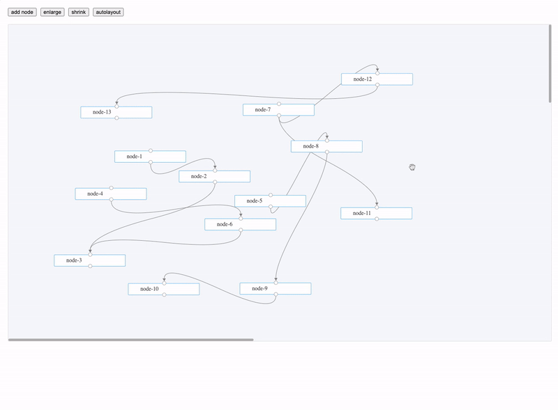

# sun-hierarchy

A library for hierarchy graph layout based on sugiyama framework



## Intro

This library is based on sugiyama framework, there are 4 steps to handle input graph

1. divide the input graph into separate isolate graphs
2. use longest path to determine hierarchy of each graph
3. reduce crossings by heuristic barycentric method
4. position vertices of each level with essay: "Fast and Simple Horizontal Coordinate Assignment"

## Playground

https://sylsaint.github.io/sun-hierarchy-playground/

## Usage

```typescript
import layout, { Graph, Vertex, Edge, LayoutOptions } from 'sun-hierarchy';

const options: LayoutOptions = {
  // node width
  width: 150,
  // node height
  height: 50,
  // node margin
  margin: { left: 0, right: 0, top: 0, bottom: 0 },
  // barycentric iteration round number, default 12  
  barycentricOptions: { totalRound: 10 }
};

const vertices: Vertex[] = [];
for (let i = 0; i < 10; i++) {
  vertices.push(new Vertex(i));
}
const edges: Edge[] = [];
edges.push(new Edge(vertices[1], vertices[4]));
edges.push(new Edge(vertices[1], vertices[5]));
edges.push(new Edge(vertices[4], vertices[3]));
edges.push(new Edge(vertices[5], vertices[2]));
edges.push(new Edge(vertices[6], vertices[2]));
edges.push(new Edge(vertices[7], vertices[3]));
edges.push(new Edge(vertices[7], vertices[9]));
edges.push(new Edge(vertices[8], vertices[5]));

const g: Graph = new Graph(vertices.slice(1), edges, { directed: true });
const graphs: Graph[] = layout(g, options);

```
